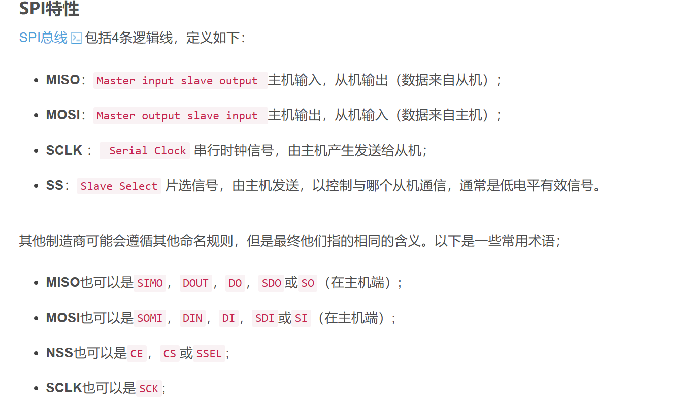
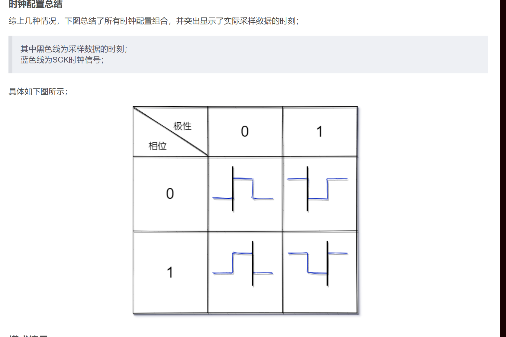

# ==**一、SPI通信协议==**

## 	1.外设引脚

## 	2.极性（CPK、CPOL）：
	初始电平
## 	3.相位（CKE、CPHA）：             
	0 第一次电平跳变后开始采样
	1 第二位电平跳变后开始采样
## 	4.模式
	极性与相位组合成4种模式

### 	**5.DMA模式**：直接访问内存，跳过CPU，通信速率快

### 	**6.使用函数**：SPI_Send_Receive_Data（）；

​        		HAL_SPI_TransmitReceive（）；
​			HAL_SPI_TransmitReceive_DMA（）；

### 	**7.连接方式**：   

​		      多从机模式，1主机对多从机

​            	  菊花链模式     环形链接，通过NSS开启两相邻外设                 
​	             

# ==二、IMU==
## 	**1.通信协议**
	SPI通信
## 	2.初始化流程  	
####     	a.创建新的电机对象和IMU对象

	Class_DJI_Motor_C620 yaw_test;
	
	Class_IMU imu_test;

####     	b.初始化   
	 --驱动层初始化
	 	can通信初始化
			CAN_Init(&hcan1,callback);
		 陀螺仪SPI通信          
			SPI_Init(&hspi1,Device_SPI1_Callback);
		磁力计IIC通信初始化
		    IIC_Init(&hi2c3, Ist8310_IIC3_Callback);
	**ps:驱动层初始化与交互层初始化顺序勿互换**
			**若互换，由于SPI通信协议赋值在前，外设初始化赋值在后，存储信息的结构体的数据为零，会引发自检错误**    
	--交互层初始化
		电机初始化和imu初始化		
			yaw_test.Init(&hcan1,DJI_Motor_ID_0x202);
			imu_test.Init();
		双环PID初始化
			 yaw_test.PID_Angle.Init(1500,0,0,0,5,180,0);
			 yaw_test.PID_Omega.Init(1500,0,0,0,5,8000,0);
####     	c.回调运行
#####         		--陀螺仪
			1.Task1ms_TIM4_Callback()
			          ||
			          ||
			   单给IMU消息开的定时器 1ms       
		 imu_test.TIM_Calculate_PeriodElapsedCallback();
			 2.Task1ms_TIM5_Callback()
					  ||
					  ||
				 检测imu是否在线
		 imu_test.TIM1msMod50_Alive_PeriodElapsedCallback();
#####       		--  电机
			1.Task1ms_TIM5_Callback()
					 ||
					 ||
				检测电机是否在线
		yaw_test.TIM_Alive_PeriodElapsedCallback();
					pid外环设置
		yaw_test.PID_Angle.Set_Now(imu_test.Get_Angle_Yaw();
		yaw_test.PID_Angle.Set_Target(90);
					pid外环回调
		 yaw_test.PID_Angle.TIM_Adjust_PeriodElapsedCallback();
					pid内环设置
		 yaw_test.PID_Omega.Set_Now(imu_test.Get_Gyro_Yaw());	
	        yaw_test.PID_Omega.Set_Target(yaw_test.PID_Angle.Get_Out());
					pid内环回调			
	        yaw_test.PID_Omega.TIM_Adjust_PeriodElapsedCallback();
			  将PID运算的out赋给电机的out
	          yaw_test.Set_Out(yaw_test.PID_Omega.Get_Out());
				将输出赋值给缓冲区					
			yaw_test.output_test();
	
				统一打包发送缓冲区数据							
			TIM_CAN_PeriodElapsedCallback（）
					  ||
					  ||
		CAN_Send_Data(&hcan1, 0x200, CAN1_0x200_Tx_Data, 8);
		PS:记得注释掉chariot这个类的