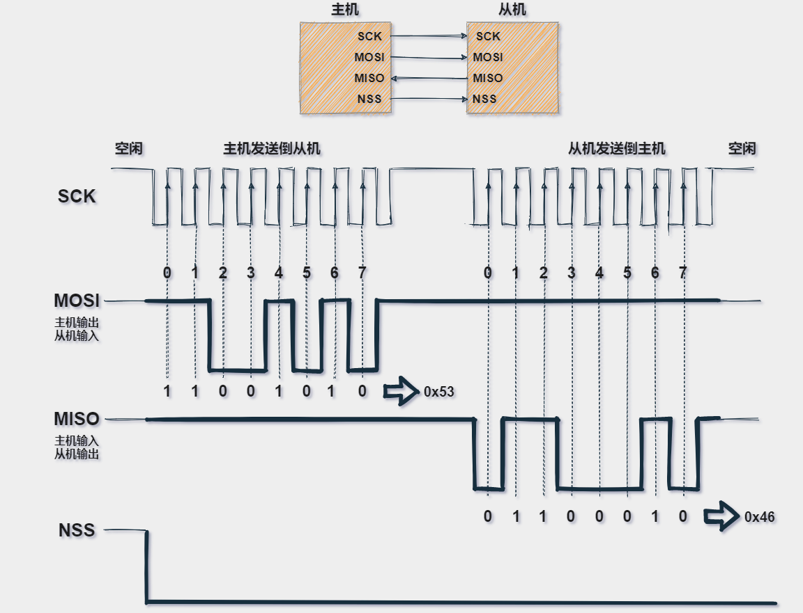

# Home_Work_2.1.2

## 一、SPI&DMA

### (1)、SPI

https://great.blog.csdn.net/article/details/109460814?fromshare=blogdetail&sharetype=blogdetail&sharerId=109460814&sharerefer=PC&sharesource=tothestar_233&sharefrom=from_link

`Struct_SPI_Manage_Object SPI2_Manage_Object = {0};`
`Struct_SPI_Manage_Object SPI3_Manage_Object = {0};`
`Struct_SPI_Manage_Object SPI4_Manage_Object = {0};`
`Struct_SPI_Manage_Object SPI5_Manage_Object = {0};`
`Struct_SPI_Manage_Object SPI6_Manage_Object = {0};`

定义了多个 `SPI_Manage_Object` 类型的结构体变量，用于管理不同SPI接口（SPI1至SPI6）的状态。

`SPI_Send_Receive_Data` 用于发送和接收SPI数据。它通过 `HAL_SPI_TransmitReceive` 或 `HAL_SPI_TransmitReceive_DMA` 函数执行数据传输：

- **SPI1**直接使用 `HAL_SPI_TransmitReceive` 来同步传输。
- **SPI2**和**SPI3**使用**DMA**方式传输，这通常用于提高数据传输效率，避免阻塞CPU。

### (2)、DMA

https://blog.csdn.net/as480133937/article/details/104927922?fromshare=blogdetail&sharetype=blogdetail&sharerId=104927922&sharerefer=PC&sharesource=tothestar_233&sharefrom=from_link

## 二、IMU

- #### 1. **`Init()` 初始化函数**

  **BMI088传感器初始化**：通过 `IMU_BMI088.init(&hspi1, &BMI088_Raw_Data)` 初始化BMI088传感器（一个集成加速度计和陀螺仪的传感器）。该传感器使用SPI通信协议与主控芯片进行数据交换。

  **IST8310传感器初始化**：通过 `IMU_IST8310.init(&hi2c3)` 初始化IST8310磁力计。该传感器使用I2C协议与主控芯片通信。

  **Mahony AHRS算法初始化**：通过 `IMU_MahonyAHRS.init(INS_Quat)` 初始化Mahony AHRS算法，计算设备的姿态（通过四元数表示）。

  **EKF初始化**：调用 `IMU_QuaternionEKF_Init` 初始化扩展卡尔曼滤波器（EKF）。EKF用于融合传感器数据，提供更精确的姿态估计。

  **温控PID初始化**：PID控制器用于调节IMU传感器的温度，以确保其在最佳工作状态。

`IMU_BMI088.init(&hspi1, &BMI088_Raw_Data);`

``IMU_IST8310.init(&hi2c3);IMU_MahonyAHRS.init(INS_Quat);`

`IMU_QuaternionEKF_Init(10, 0.001, 10000000, 1, 0, &QEKF_INS);`

`PID_IMU_Tempture.Init(2000, 3000, 0, 0.0, uint32_max, uint32_max);`

#### 2. **`TIM_Calculate_PeriodElapsedCallback()` 定时周期回调函数**

这个函数挂在TIM4定时器下

`void Task100us_TIM4_Callback()`

`{` 

 	`chariot.Gimbal.Boardc_BMI.TIM_Calculate_PeriodElapsedCallback()；`  

`}`

- **读取BMI088传感器数据**：通过 `IMU_BMI088.BMI088_Read(&BMI088_Raw_Data)` 从BMI088传感器读取加速度计和陀螺仪的数据。

- **EKF更新**：调用 `IMU_QuaternionEKF_Update` 函数，根据陀螺仪和加速度计的数据以及时间间隔，更新四元数表示的姿态。

- **机体坐标系到地球坐标系的转换**：通过 `BodyFrameToEarthFrame` 函数将机体坐标系下的加速度、速度等数据转换到地球坐标系。

- **重力消除和运动加速度计算**：使用低通滤波器对加速度进行处理，去除重力分量，得到运动加速度。

- **PID控制温度**：每50个周期使用PID算法调整传感器的温控，确保IMU的工作温度维持在50°C。

  `IMU_BMI088.BMI088_Read(&BMI088_Raw_Data); `

  `IMU_QuaternionEKF_Update(INS.Gyro[0], INS.Gyro[1], INS.Gyro[2], INS.Accel[0], INS.Accel[1], INS.Accel[2], INS_DWT_Dt ,&QEKF_INS); `

  `BodyFrameToEarthFrame(X_b, INS.xn, INS.q); `

  `BodyFrameToEarthFrame(Y_b, INS.yn, INS.q); `

  `BodyFrameToEarthFrame(Z_b, INS.zn, INS.q);` 

  #### 3. **`TIM1msMod50_Alive_PeriodElapsedCallback()` 通信状态检测**

  **IMU掉线检测**：如果当前加速度数据与上次的加速度数据相同，说明IMU可能失去通信，设置 `IMU_Status` 为禁用状态。

## 三、四元数

### （1）理解四元数：

【四元数的可视化】 https://www.bilibili.com/video/BV1SW411y7W1/?share_source=copy_web&vd_source=97c51f13ade77290263b556ca22b2c33

