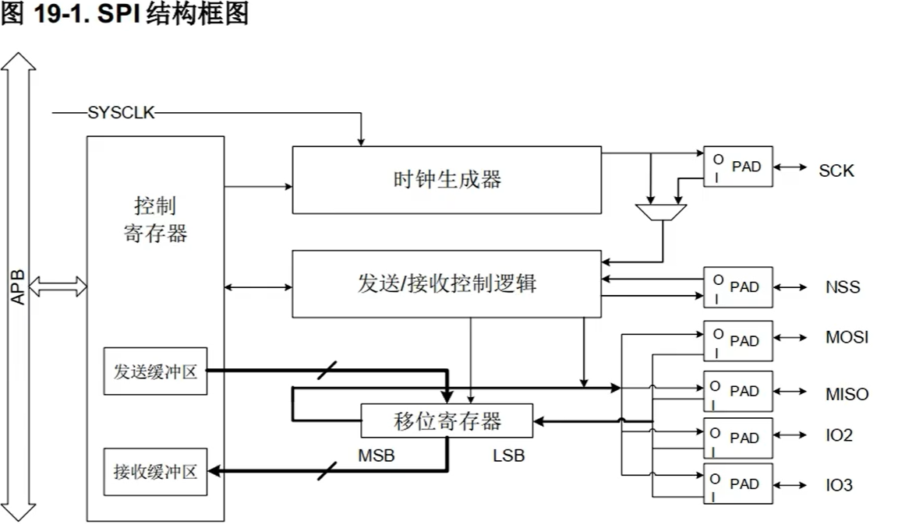
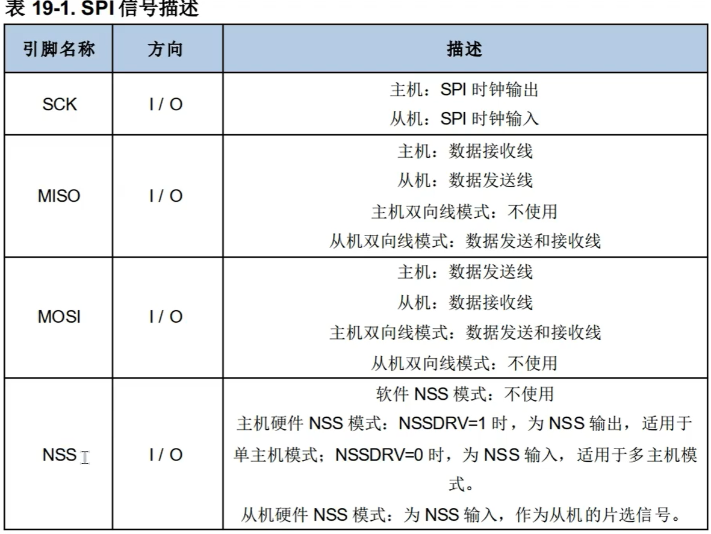
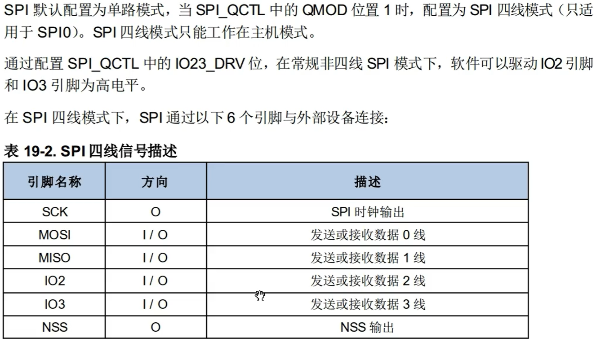
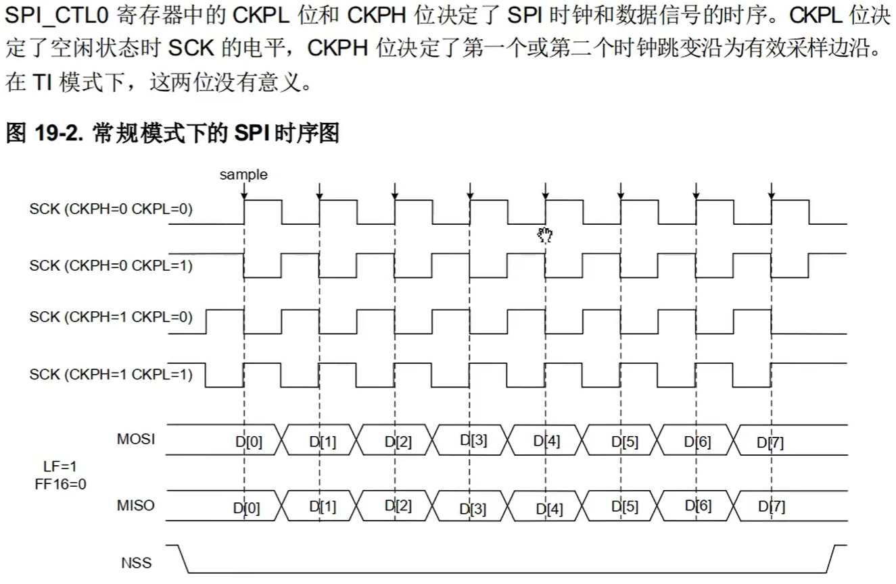
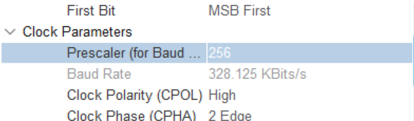

# 学习记录

## Ⅰ.SPI

- **概念**：SPI是一种串口外设通信，主要通过主机(Master)和从机(Slave)之间互相发送数据的方式进行通信，一个主机可以连接多个从机。

***

- **基础配置**：SPI

主要分成非四线和四线两种模式，非SPI四线模式各引脚作用如图，

一般来说不使用NSS而是额外配置一个IO口来选择拉高拉低电平，相对来说更灵活

SPI四线模式如图(仅了解，区别在于多了两个发送和接受的数据线，收发数据量更多)，

SPI时序是由CKPH,CKPL决定的，CKPL的值为0/1指的是默认电平为低/高电平，CKPH的值为0/1指的是从奇数/偶数个边沿采样，当NSS被拉低时意味着寄存器开始接受数据

***

在实验室infantry的CUBEMX配置中：

 

选用的是全双工的主机模式，即主机发送和接收同时进行

选择自己配置IO口作为NSS

这些配置需要查询对应从机元件的数据手册配置