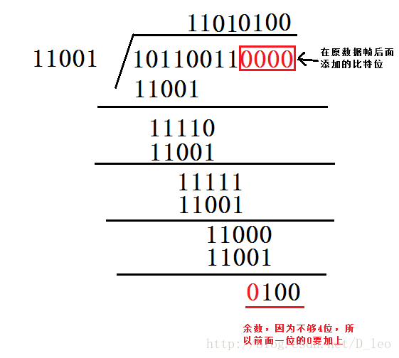

# Home_Work_2.1.3

## 1、CRC校验

https://blog.csdn.net/u013073067/article/details/86621770

CRC校验本质上是选取一个合适的除数，要进行校验的数据是被除数，然后做模2除法，得到的余数就是CRC校验值。

下面用具体的例子做讲解：给定一组数据A：10110011（二进制），选取除数B：11001。

首先需要在被除数A后加4个比特位0（具体加几个0是根据除数B的位数决定的，比如这里B是5位，那么A后面加4个0；如果B选6位，则A后面加5个0，总之加的0的个数比除数B的个数少1位。后面还会提到怎么添加）。
进行模2除法运算。注意每次都是模2运算，即异或。
最后得到余数C就是CRC校验值。注意余数位数必须比除数少1位，如果不够前面加0补齐。运算如下图所示
            

## 

模 2 除法是一种在二进制系统中进行的除法运算，主要用于循环冗余校验码（CRC）的计算。它与普通的算术除法类似，但有一些关键的不同之处。

基本概念

模 2 除法的实质是异或运算。在模 2 除法中，每一位的除法结果不会影响其他位，即不需要向上一位借位。模 2 加法和模 2 减法的规则如下：

- 1 + 1 = 0
- 0 + 1 = 1
- 0 + 0 = 0
- 1 - 1 = 0
- 0 - 1 = 1
- 1 - 0 = 1

这些运算相当于二进制中的逻辑异或运算。

示例

以下是一个模 2 除法的具体示例：

假设我们有一个被除数 1111000 和一个除数 1101。我们可以按照以下步骤进行模 2 除法：

1. 将被除数和除数对齐，并进行异或运算。
2. 如果余数的首位是 1，则商为 1，否则商为 0。
3. 将余数右移一位，并继续进行异或运算，直到处理完所有位。

具体步骤如下：

1111000 ÷ 1101

步骤 1: 1111 ⊕ 1101 = 0010

步骤 2: 0100 ⊕ 1101 = 1001

步骤 3: 0010 ⊕ 1101 = 0111

最终得到的商为 110，余数为 1

