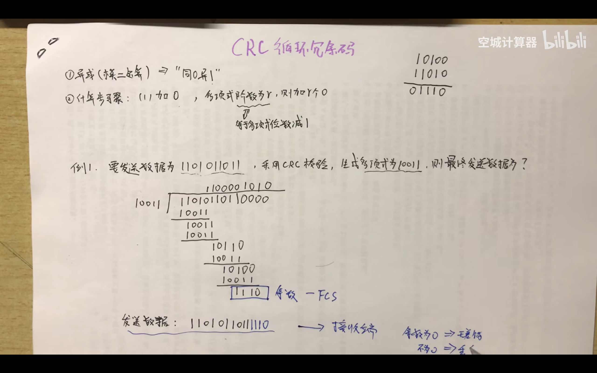

- [ ] # 裁判系统

## 一、CRC循环冗余校验
###         1.异或
		同0异1
###         2.循环冗余码的计算

PS:CRC8_TAB[256] 是一个预计算的查找表，用于加速 CRC8 校验码的计算,避免复杂的除法计算

## 一、使用流程
###         1.初始化
#define chassis
```C
//底盘和云台均有一块C板，而只有底盘有裁判系统的实例
		#define chassis
			Task_Init();
				||
				||
			a. chariot.Init();
                        ||
                        ||
			     //1.裁判系统初始化，将指针指向对应储存信息的结构体实例，
			     //2.获取帧头，初始化时帧头为默认值0xa5
			     Referee.Init(&huart6);
			     //Chassis.Referee为一个裁判系统类的指针，指向外层chariot的裁判系
			     // 统，所以实际上的裁判系统信息来源于底盘chassis
				Chassis.Referee = &Referee;
			b. UART_Init(&huart6, Referee_UART6_Callback, 128);
				//接收裁判系统的数据，再传给UART1_Manage_Object这个结构体
				//顺便启动Referee_UART6_Callback回调函数
	
```
#define GIMBAL

###         2.中断回调
#define chassis
```C
A. //启动定时器和中断回调函数
		TIM_Init(&htim5, Task1ms_TIM5_Callback);
					||
					||
			a. chariot.TIM1msMod50_Alive_PeriodElapsedCallback();
							||
							||
				 //检测裁判系统是否在线
				 Referee.TIM1msMod50_Alive_PeriodElapsedCallback();
			b. chariot.TIM_Calculate_PeriodElapsedCallback();
							||
							||
				// 将底盘裁判系统得到的ID、比赛状态、枪口热量上限和冷却CD赋值给缓冲区CAN2_Chassis_Tx_Gimbal_Data       
				CAN_Chassis_Tx_Gimbal_Callback();			 
				PS:memcpy()函数可以按指针进行无大小的限制赋值给指针对应的缓冲区，因此需要控制好对应的地址	
				eg://赋给CAN2_Chassis_Tx_Gimbal_Data[2]和CAN2_Chassis_Tx_Gimbal_Data[3]的是发射机构的冷却值         				memcpy(CAN2_Chassis_Tx_Gimbal_Data + 2, &Shooter_Barrel_Heat_Limit, sizeof(uint16_t));                                       
                      //赋给CAN2_Chassis_Tx_Gimbal_Data[4]和CAN2_Chassis_Tx_Gimbal_Data[5]的是发射机构的冷却值                   memcpy(CAN2_Chassis_Tx_Gimbal_Data + 4, &Shooter_Barrel_Cooling_Value, sizeof(uint16_t));                                       	
B.  //处理裁判系统传出信息
UART_Init(&huart6, Referee_UART6_Callback, 128);
							||
							||
				 Referee_UART6_Callback();
							||
							||
			 chariot.Referee.UART_RxCpltCallback(Buffer,Length);
						    ||
						    ||
					 Data_Process();
	
					 
```
#define GIMBAL
```C
//接收下板数据
	Gimbal_Device_CAN2_Callback();
				||
chariot.CAN_Gimbal_Rx_Chassis_Callback();
				||
				||
//解包下板数据，获取ID、比赛状态、枪口热量上限和冷却CD				
	CAN_Gimbal_Rx_Chassis_Callback();
	PS:referee可以用于上位机判断红蓝方
```


###         3.统一打包发送
```C
		TIM_CAN_PeriodElapsedCallback();
						||
						||
	CAN_Send_Data(&hcan2, 0x88, CAN2_Chassis_Tx_Gimbal_Data, 8);
```

## 二、解包
				Data_Process();
				       ||
				       ||
				判断帧头和CRC校验是否通过
					   ||
					   ||
				通过不同ID进行赋值操作      