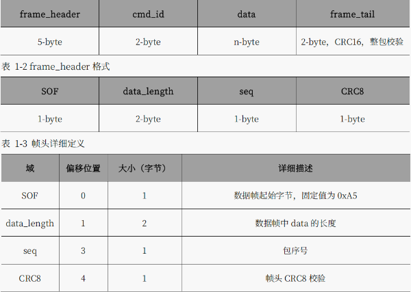
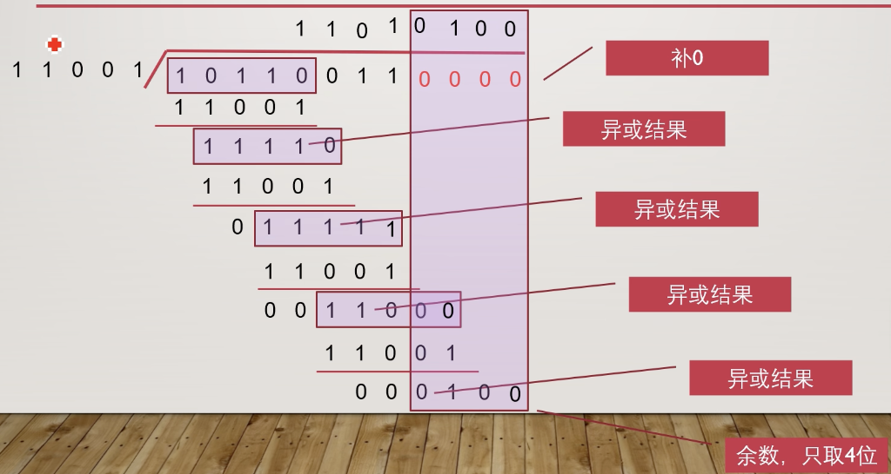
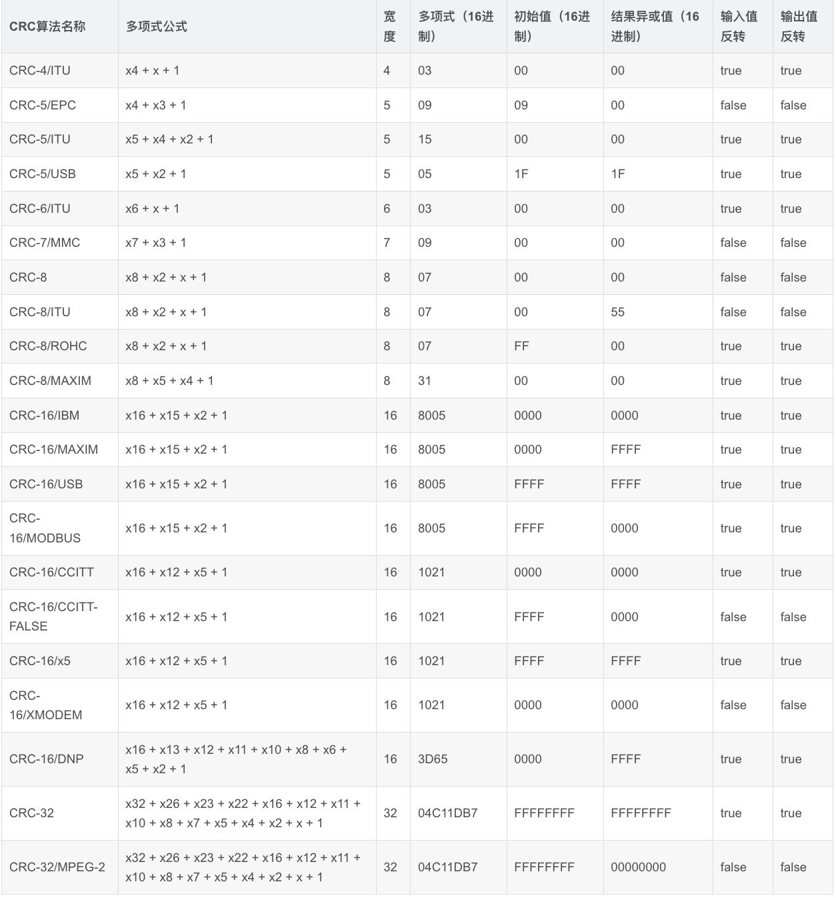

# 裁判系统

- ==一个全自动的电子判罚系统==
- 
- 串口通信
  - 波特率115200，8位数据位，1位停止位，无硬件流控，无校验位
  - 
  - 常规链路
  	- 机器人→电源管理模块→主控模块→服务器
  - 图传链路
  	- 机器人→图传发送端→图传接收端→PC

```cpp
//初始化
void Class_Referee::Init(UART_HandleTypeDef *huart, uint8_t __Frame_Header){}

//数据处理
void Class_Referee::Data_Process(){
//循环遍历接收缓冲区
//帧头条件判断+CRC 检验
	//数据处理,合并字节,拷贝数据
}

//接收回调
void Class_Referee::UART_RxCpltCallback(uint8_t *Rx_Data,uint16_t Length){}

//定时器中断检测系统状态
void Class_Referee::TIM1msMod50_Alive_PeriodElapsedCallback(){}

//字符数据的绘制与打包
void Class_Referee::Referee_UI_Packed_String(){}


```
- Cyclic Redundancy Check(循环冗余校验)

- <u>一种用于检测数据传输或存储错误的校验算法</u>

  

  

  # CRC
## 0 模二运算

- <u>一种适用于二进制的算法</u>
- 不考虑进位和借位
- 模二加法和模二减法的结果是相同的，均能用异或运算（不同为 1）来代替
- 模二除法
    - 约定除数，检验余数
- 选取生成多项式为 11001，原始数据为 10110011，则 CRC 校验值为 0100，发送数据为101100110100


# 1 代码实现
- 参数模型


## 1.1 代码示例
```cpp
//计算校验和
unsigned char Get_CRC8_Check_Sum(unsigned  char  *pchMessage,unsigned  int dwLength,unsigned char ucCRC8)
{
    unsigned char ucIndex;
    while (dwLength--)
    {
    ucIndex = ucCRC8^(*pchMessage++);
    ucCRC8 = CRC8_TAB[ucIndex];
    }
    return(ucCRC8);
}

//验证C校验和
unsigned int Verify_CRC8_Check_Sum(unsigned char *pchMessage, unsigned int dwLength)
{
    unsigned char ucExpected = 0;
    if ((pchMessage == 0) || (dwLength <= 2)) return 0;
    ucExpected = Get_CRC8_Check_Sum (pchMessage, dwLength-1, CRC8_INIT);
    return ( ucExpected == pchMessage[dwLength-1] );
}

//在消息末尾追加校验和
void Append_CRC8_Check_Sum(unsigned char *pchMessage, unsigned int dwLength)
{
    unsigned char ucCRC = 0;
    if ((pchMessage == 0) || (dwLength <= 2)) return;
    ucCRC = Get_CRC8_Check_Sum ( (unsigned char *)pchMessage, dwLength-1, CRC8_INIT);
    pchMessage[dwLength-1] = ucCRC;
}

```
