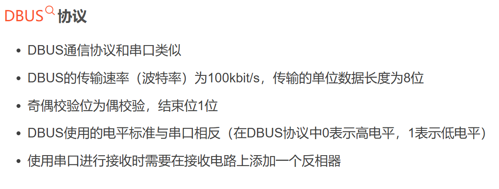
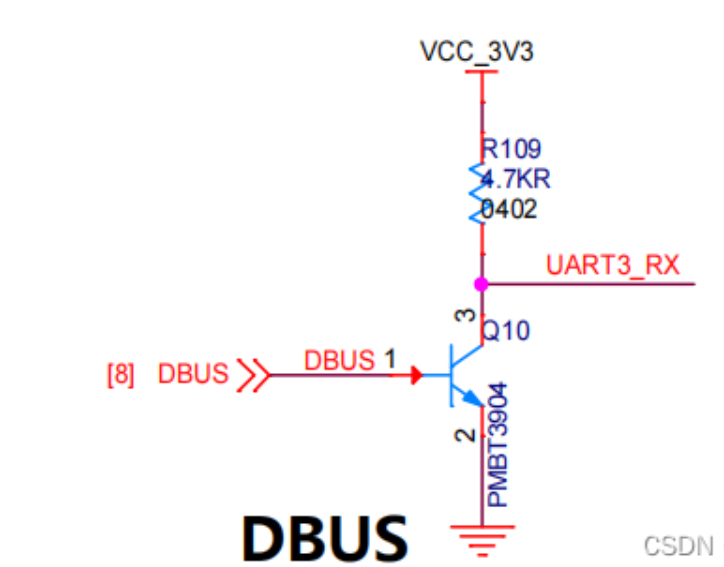

# 一、DBUS接收机

## 1.奇偶校验
+ 校验位：0或1
     一般放置在最后一位或第一位
+ **奇**校验：若1的数量为奇数，则在校验位加0
		 若1的数量不为奇数，则在校验位加1
		 ps:及数量够奇数个，补0；数量不够奇数个，补1。
		 ==让数据帧中1的个数保持为奇数。（不能减少，只能增加）==
+ **偶**校验：若1的数量为偶数，则在校验位加0
		 若1的数量不为偶数，则在校验位加1
		 ps:及数量够偶数个，补0；数量不够偶数个，补1
		 ==让数据帧中1的个数保持为偶数。（不能减少，只能增加）==

## 2.反向器
+ 作用：将DBUS输出的电平翻转,供串口使用
+ 硬件电路：
	
	    上图使用的是NPN三极管
	a.当DBUS输入显性电平0时，基极B与发射极E的电压差为0，小于0.7V，三极管断开，
    VCC_3V3与UART3_RX相连，输出给UART3_RX的显性电平1
	b.当DBUS输入隐性电平1时，基极B与发射机E的电压差对于0.7V,三极管导通，VCC_3V3与地相连，输出给UART3_RX的隐性电平0
# 二、代码
##         1.初始化
```C
	//串口初始化，启动DMA,用结构体接收数据
	UART_Init(huart, UART_Call_Back Callback_Function,Rx_Buffer_Length);
	//UART回调函数
	A DR16_UART3_Callback()；
	B Image_UART6_Callback()；
```
##         2.回调函数
**HAL_UARTEx_RxEventCallback(**)中调用结构体中的函数指针，指向上述两个函数

####            A.数据处理
+              ```
	a.DR16_UART3_Callback();//遥控器
		            ||
        	            ||
	chariot.DR16.DR16_UART_RxCpltCallback(Buffer);
					||
					||
	  //保存当前数据（n），用于判断遥控器是否在线和使用遥控器传出进行映射，以及触发拨码盘
			 DR16_Data_Process();
			 		||
    		 		||
      //判断及设置拨码盘状态
        Judge_Switch(&Data.Left_Switch, tmp_buffer->Switch_1, Pre_UART_Rx_Data.Switch_1);
      //判断及设置键鼠状态			
    			Judge_Key();
      //保留上一次数据（n-1）	
    memcpy(&Pre_UART_Rx_Data, UART_Manage_Object_1->Rx_Buffer, sizeof(Struct_DR16_UART_Data));	
    ```
    
    ​	
+            ```
	b.Image_UART6_Callback();//裁判系统
					||
					||
	 //获取ID,数据字长来校验；通过校验后，进行数据处理
		Image_UART_RxCpltCallback();
					||
					||
	 //	保存当前数据（n）,检测鼠标、键盘，实现电脑端通过裁判系统进行操控
			Image_Data_Process();
			//判断及设置键鼠状态			
				Judge_Key();
	 //保留上一次数据（n-1）	
	memcpy(&Pre_UART_Image_Rx_Data, &Rx_Data[7], sizeof(Struct_Image_UART_Data)); 
	```
	
	
####            B.改变底盘，云台，发射机构的控制策略
         chariot.TIM_Control_Callback();
    			    ||
    			    ||
      //判断DR16控制数据来源，遥控器或键鼠
    	Judge_DR16_Control_Type();
      //底盘，云台，发射机构控制逻辑
    		Control_Chassis();
    		Control_Gimbal();
    		Control_Booster();
    			|| || ||
    			|| || ||
      //根据Judge_DR16_Control_Type()设置的控制状态,
      //和XXX_Data_Process()中设置的遥控器状态和键鼠状态
      //控制三者的控制逻辑	


​		
​			