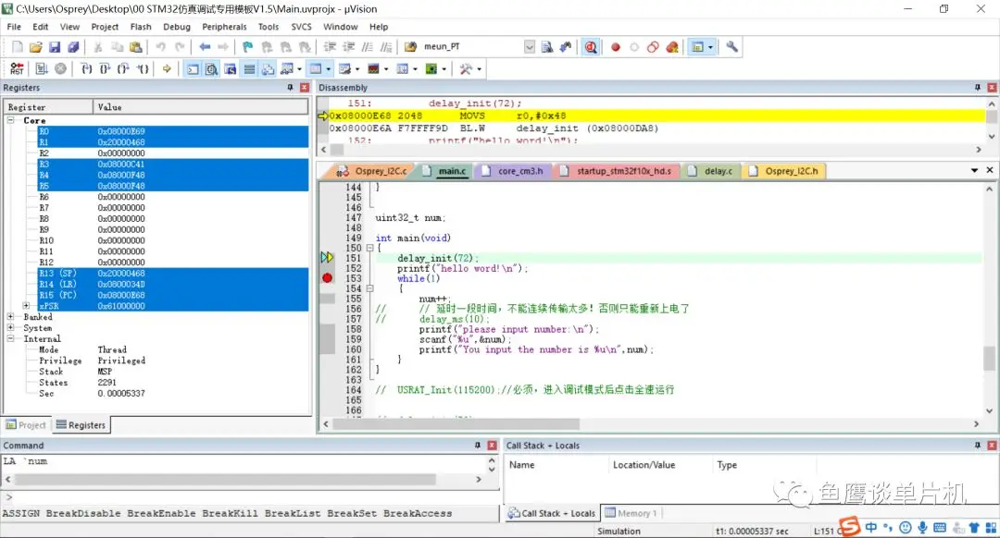

# Keil MDK

## 调试

- 进入 Debug 界面
    - 黄色光标指向的语句是准备执行的语句

      
    
- 配置
    - Debug-Run to main()  进入调试模式后直接运行到 main（）
    
- 工具栏从左到右依次为
    - 复位，运行，停止
    - 汇编层面单步调试，快速执行完此函数体并准备执行下一条语句
    
- 快捷键
    - CTR+F10
        - 运行到蓝色光标处并准备执行光标处语句
    
- Watch 窗口
    - 实时观测数据
    - 支持在线修改数据
    
- Memory 窗口
    - 可读取 FLASH 数据和 RAM 数据
    - 0x08000000 表示FLASH 地址开始处
    - 支持在线修改数据
    
- Call Stack + Locals 窗口
    - 可查看局部变量
    - 可以查看函数的调用顺序，最新调用的函数在最下面
    - 可以查看当前函数的上层调用函数位置，可用于错误中断找到错误代码位置
    
- 外设窗口
    - Peripherals-Core Peripherals
        - 可查看大部分外设，时钟，中断情况

# VSCode

## 配置

- 插件
  - C/C++
  - Cortex-Debug
  - Embedded IDE
    - 安装实用工具
      - Cppcheck (Code Inspection)
      - GNU Arm Embedded Toolchain (stable)
      - OpenOCD Programmer (v0.12.0-rc2)
      - STM32 Cube Programmer CLI
    - 打开插件设置
      - 复制 Keil 安装目录下 ARMCC, ARMCLANG 文件夹路径
      - 勾选编译完成后将 .axf 转换为 .elf

