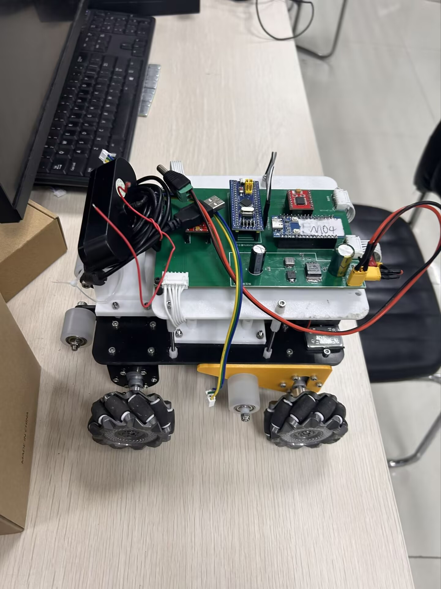

# 基于四电机控制的WIFI遥控麦轮底盘小车

- 整体展示
  

# 硬件使用

- stm32f103c8t6
- esp32c3
- TB6612FNG   2
- 降压模块
- 接线部分详见    引脚选择文件

# 软件部分

- 软件使用

  - keil +cubemx

  - ozone

- 代码实现

  - 应用层使用cpp语言
  - 具体应用代码详见Applications文件夹
  - main.cpp中实现初始化与控制函数
  - 串口接收WIFI遥控数据
  - 引脚外部中断读取编码器值
  - PID闭环控制电机

# 附录

### 无线控制部分

- esp32与手机的链接
  - WLG
  - 12345678
  - 192.168.1.11
- esp32 串口下发给 f103
  - 配置默认
  - 五字节数据包
  - 帧头 0xA5
  - 按键状态
    - 按下是 1,不按是 0
    - bit0-FORWARD-前进
    - bit1-BACK-后退
    - bit2-Jump-跳跃(无跳跃,此变量控制小车静止)
    - bit3-LEFT-左平移
    - bit4-RIGHT-右平移
    - bit5-Robot Go!-切换形态(上位机控制/WF 遥控)
  - 摇杆 X
    - 0-200
    - 左右旋转
  - 摇杆 Y
    - 0-200
    - 前进后退
  - 帧尾 0x5A
